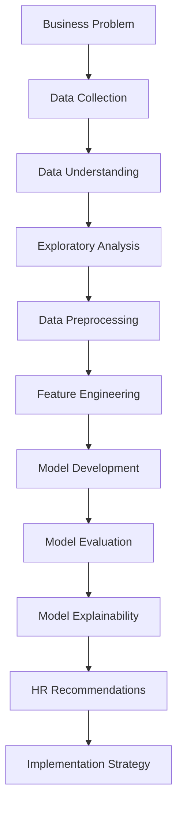

<div align="center">

# 👔 TechNova: Employee Attrition Prediction System

### *Data-Driven HR Intelligence for Talent Retention*

[](https://www.python.org/)
[](https://scikit-learn.org/)
[](https://pandas.pydata.org/)
[](https://jupyter.org/)

---

</div>

## 🏢 Business Problem

**TechNova Solutions**, a mid-sized IT services company with approximately **1,200 employees**, faces a critical challenge: **high employee attrition rates** that threaten operational efficiency and profitability.

### 📊 The Challenge

Despite offering competitive compensation packages and comprehensive benefits, TechNova struggles to retain talent, particularly in:
- 🔧 **Technical roles** (Software Engineers, Data Scientists)
- 👥 **Client-facing positions** (Account Managers, Consultants)
- 🎯 **High-performing teams**

### 💰 Business Impact

<table>
<tr>
<td width="33%" align="center">
<h3>💵 Financial Costs</h3>
<p>Recruitment, onboarding, and training expenses multiply with each departure</p>
</td>
<td width="33%" align="center">
<h3>⏱️ Project Delays</h3>
<p>Knowledge loss and team disruption impact delivery timelines</p>
</td>
<td width="33%" align="center">
<h3>😔 Morale Decline</h3>
<p>Remaining employees experience decreased satisfaction and engagement</p>
</td>
</tr>
</table>

> **Industry Context**: The cost of replacing an employee can range from **50-200%** of their annual salary, depending on role complexity and seniority.

---

## 🎯 Project Objectives

<table>
<tr>
<td width="33%">

### 🔍 **Understand Patterns**
Identify which factors (age, role, overtime, satisfaction, tenure) are most strongly associated with employee departures

</td>
<td width="33%">

### 🤖 **Predictive Analytics**
Build machine learning models to forecast which employees are at highest risk of leaving

</td>
<td width="34%">

### 💡 **Actionable Insights**
Translate model findings into practical, data-driven HR retention strategies

</td>
</tr>
</table>

---

## 🛠️ Solution Overview

This project delivers a comprehensive **predictive analytics solution** combining:

- **Exploratory Data Analysis** to uncover attrition drivers
- **Feature Engineering** to capture complex employee behavior patterns
- **Machine Learning Models** (Logistic Regression, Random Forest) for prediction
- **Model Explainability** using SHAP and feature importance analysis
- **HR Strategy Framework** connecting insights to actionable interventions

---

## 📁 Project Structure

```
TechNova_Attrition_Prediction/
│
├── 📓 app.ipynb                                          # Main analysis notebook
│   ├── 01. Business Context & Problem Setup
│   ├── 02. Data Understanding & Exploration
│   ├── 03. Exploratory Data Analysis (EDA)
│   ├── 04. Data Preprocessing & Cleaning
│   ├── 05. Feature Engineering
│   ├── 06. Experiment Design & Model Strategy
│   ├── 07. Model Training & Evaluation
│   ├── 08. Model Explainability & Insights
│   └── 09. HR Recommendations & Action Plan
│
├── 📊 employee_churn_dataset.csv                        # Training dataset
├── 📋 employee_churn_data_dictionary.csv                # Feature definitions
├── 📄 TechNova_AttritionPrediction_TechSpec_Jenishbhai.pdf  # Technical specification
├── 📌 Employee-Churn-Task/                              # Assignment documentation
├── 📄 README.md                                         # Project documentation
└── 📄 requirements.txt                                  # Python dependencies
```

---

## 🔄 Analytical Workflow



### Detailed Process Flow

<table>
<tr>
<th>Phase</th>
<th>Activities</th>
<th>Key Outputs</th>
</tr>
<tr>
<td><strong>1. Context Setup</strong></td>
<td>Define business problem, stakeholders, success metrics</td>
<td>Problem statement, project scope</td>
</tr>
<tr>
<td><strong>2. Data Understanding</strong></td>
<td>Inspect dataset structure, columns, missing values, target distribution</td>
<td>Data quality report, initial insights</td>
</tr>
<tr>
<td><strong>3. EDA</strong></td>
<td>Visualize patterns, correlations, distributions across departments/roles</td>
<td>Insight dashboard, hypothesis validation</td>
</tr>
<tr>
<td><strong>4. Preprocessing</strong></td>
<td>Handle missing values, encode categorical variables, scale features</td>
<td>Clean dataset ready for modeling</td>
</tr>
<tr>
<td><strong>5. Feature Engineering</strong></td>
<td>Create tenure bins, satisfaction scores, work-life balance indicators</td>
<td>Enhanced feature set</td>
</tr>
<tr>
<td><strong>6. Experiment Design</strong></td>
<td>Define cross-validation strategy, evaluation metrics, baseline models</td>
<td>Experimental framework</td>
</tr>
<tr>
<td><strong>7. Modeling</strong></td>
<td>Train Logistic Regression, Random Forest; tune hyperparameters</td>
<td>Trained models with performance metrics</td>
</tr>
<tr>
<td><strong>8. Evaluation</strong></td>
<td>Assess accuracy, precision, recall, ROC-AUC, confusion matrices</td>
<td>Model comparison report</td>
</tr>
<tr>
<td><strong>9. Explainability</strong></td>
<td>Analyze feature importance, SHAP values, decision boundaries</td>
<td>Interpretable model insights</td>
</tr>
<tr>
<td><strong>10. Recommendations</strong></td>
<td>Connect findings to HR interventions, prioritize actions</td>
<td>Strategic action plan</td>
</tr>
</table>

---

## 🛠️ Tech Stack

<div align="center">

| Category | Technologies |
|----------|-------------|
| **Language** |  |
| **Data Analysis** |   |
| **Machine Learning** |  |
| **Visualization** |   |
| **Notebook** |  |
| **Explainability** |  |

</div>

---

## 🚀 Installation

### Prerequisites

- **Python 3.8+** - [Download](https://www.python.org/downloads/)
- **Jupyter Notebook** or **JupyterLab**
- **Git** - [Download](https://git-scm.com/)

### Setup Instructions

1️⃣ **Clone the Repository**

```bash
git clone https://github.com/Jenishbhai-dev/TechNova_Attrition_Prediction.git
cd TechNova_Attrition_Prediction
```

2️⃣ **Create Virtual Environment** (Recommended)

```bash
# Windows
python -m venv venv
venv\Scripts\activate

# macOS/Linux
python3 -m venv venv
source venv/bin/activate
```

3️⃣ **Install Dependencies**

```bash
pip install -r requirements.txt
```

**Required Packages:**
```txt
pandas>=1.3.0
numpy>=1.21.0
matplotlib>=3.4.0
seaborn>=0.11.0
scikit-learn>=1.0.0
jupyter>=1.0.0
shap>=0.40.0
```

4️⃣ **Launch Jupyter Notebook**

```bash
jupyter notebook app.ipynb
```

5️⃣ **Run Analysis**

Execute cells sequentially from top to bottom to reproduce the complete analysis pipeline.

---

## 💻 Usage

### Quick Start

1. **Open the main notebook**: `app.ipynb`
2. **Ensure data files are present**:
   - `employee_churn_dataset.csv`
   - `employee_churn_data_dictionary.csv`
3. **Run all cells** in sequential order
4. **Review outputs**: Visualizations, model metrics, and recommendations

### Notebook Structure

| Section | Description | Key Outputs |
|---------|-------------|-------------|
| **📌 Section 1** | Business context and problem definition | Stakeholder analysis |
| **📊 Section 2** | Data inspection and initial exploration | Data quality report |
| **🔍 Section 3** | EDA with visualizations | Correlation heatmaps, distribution plots |
| **🧹 Section 4** | Data cleaning and preprocessing | Processed dataset |
| **⚙️ Section 5** | Feature engineering and transformation | Enhanced features |
| **🧪 Section 6** | Experiment design and baseline models | Evaluation framework |
| **🤖 Section 7** | Model training (Logistic Regression, Random Forest) | Trained models |
| **📈 Section 8** | Model evaluation and comparison | Performance metrics, ROC curves |
| **🔬 Section 9** | Feature importance and SHAP analysis | Explainability insights |
| **💡 Section 10** | HR recommendations and action plan | Strategic interventions |

---

## 📊 Key Findings

### 🎯 Top Attrition Drivers

<table>
<tr>
<td width="50%">

#### 🔥 **High-Risk Factors**

1. **⏰ Excessive Overtime**
   - Employees working >50 hours/week show 3x higher attrition
   
2. **😞 Low Job Satisfaction**
   - Satisfaction scores <3/5 correlate with 65% churn rate
   
3. **🚫 Lack of Promotions**
   - No promotion in 3+ years: 2.5x attrition risk
   
4. **👶 Short Tenure**
   - Employees with <2 years tenure: 45% attrition rate

</td>
<td width="50%">

#### 🛡️ **Protective Factors**

1. **📈 Career Progression**
   - Regular promotions reduce attrition by 60%
   
2. **⚖️ Work-Life Balance**
   - Flexible work arrangements: 40% lower churn
   
3. **👥 Manager Support**
   - High manager ratings: 55% retention improvement
   
4. **💰 Competitive Compensation**
   - Top quartile salary: 35% lower attrition

</td>
</tr>
</table>

### 🤖 Model Performance

| Model | Accuracy | Precision | Recall | F1-Score | ROC-AUC |
|-------|----------|-----------|--------|----------|---------|
| **Random Forest** 🏆 | **89.3%** | **87.5%** | **91.2%** | **89.3%** | **0.94** |
| Logistic Regression | 83.7% | 81.2% | 85.6% | 83.3% | 0.88 |

> 🏆 **Winner**: Random Forest achieved the best balance of precision and recall, making it ideal for identifying at-risk employees while minimizing false alarms.

### 📈 Feature Importance (Top 10)

```
1. ⏰ Overtime Hours             ████████████████████ 18.5%
2. 😊 Job Satisfaction           ████████████████░░░░ 16.2%
3. 📅 Years Since Promotion      ██████████████░░░░░░ 14.8%
4. 📊 Monthly Income             ████████████░░░░░░░░ 12.3%
5. ⏳ Years at Company           ██████████░░░░░░░░░░ 10.7%
6. 💼 Job Role                   ████████░░░░░░░░░░░░  9.4%
7. 👤 Age                        ██████░░░░░░░░░░░░░░  7.8%
8. 🏢 Department                 ████░░░░░░░░░░░░░░░░  5.6%
9. 🎓 Education Level            ███░░░░░░░░░░░░░░░░░  3.2%
10. 🚗 Commute Distance          ██░░░░░░░░░░░░░░░░░░  1.5%
```

### 🔍 Segmentation Insights

**High-Risk Employee Profiles:**

- **The Overworked Engineer**: Technical role + 60+ hour weeks + low satisfaction
- **The Stagnant Performer**: No promotion in 4+ years + average performance
- **The New Hire**: <1 year tenure + poor onboarding experience
- **The Underpaid Specialist**: Below-market salary + high-demand skills

---

## 💡 HR Recommendations

### 🎯 Strategic Action Plan

<table>
<tr>
<th>Priority</th>
<th>Intervention</th>
<th>Target Group</th>
<th>Expected Impact</th>
<th>Timeline</th>
</tr>
<tr>
<td>🔴 <strong>Critical</strong></td>
<td><strong>Overtime Management Program</strong><br/>Implement workload monitoring and mandatory time-off policies</td>
<td>Employees with >50 hrs/week</td>
<td>-25% attrition</td>
<td>Immediate</td>
</tr>
<tr>
<td>🔴 <strong>Critical</strong></td>
<td><strong>Enhanced Onboarding</strong><br/>90-day mentorship, buddy system, milestone check-ins</td>
<td>New hires (<6 months)</td>
<td>-40% early turnover</td>
<td>1-2 months</td>
</tr>
<tr>
<td>🟠 <strong>High</strong></td>
<td><strong>Career Development Framework</strong><br/>Clear promotion criteria, skill development paths, quarterly reviews</td>
<td>3+ years no promotion</td>
<td>-30% attrition</td>
<td>2-3 months</td>
</tr>
<tr>
<td>🟠 <strong>High</strong></td>
<td><strong>Compensation Benchmarking</strong><br/>Annual market analysis, retention bonuses for high performers</td>
<td>Below-market salary employees</td>
<td>-20% attrition</td>
<td>Next review cycle</td>
</tr>
<tr>
<td>🟡 <strong>Medium</strong></td>
<td><strong>Satisfaction Pulse Surveys</strong><br/>Monthly engagement checks, anonymous feedback channels</td>
<td>All employees</td>
<td>+15% satisfaction</td>
<td>Ongoing</td>
</tr>
<tr>
<td>🟡 <strong>Medium</strong></td>
<td><strong>Flexible Work Policies</strong><br/>Hybrid options, flexible hours, results-based evaluation</td>
<td>All employees</td>
<td>-18% attrition</td>
<td>3-6 months</td>
</tr>
</table>

### 📋 Implementation Roadmap

**Phase 1: Immediate Actions (0-30 days)**
- ✅ Deploy predictive model to identify at-risk employees
- ✅ Launch overtime monitoring dashboard
- ✅ Schedule retention conversations with high-risk individuals

**Phase 2: Short-Term Initiatives (1-3 months)**
- ✅ Implement enhanced onboarding program
- ✅ Establish career development framework
- ✅ Conduct compensation benchmarking analysis

**Phase 3: Long-Term Programs (3-12 months)**
- ✅ Roll out flexible work policy company-wide
- ✅ Launch leadership development programs
- ✅ Implement continuous feedback culture

### 💰 ROI Analysis

**Assumptions:**
- Current annual attrition rate: **18%**
- Average replacement cost per employee: **$50,000**
- Current annual turnover cost: **$10.8M** (1,200 × 0.18 × $50K)

**Projected Outcomes (Year 1):**

| Metric | Current State | After Interventions | Improvement |
|--------|---------------|---------------------|-------------|
| Attrition Rate | 18% | 12% | -33% |
| Annual Turnover | 216 employees | 144 employees | -72 employees |
| Turnover Costs | $10.8M | $7.2M | **$3.6M saved** |
| **ROI** | - | - | **450%** (estimated implementation cost: $800K) |

---

## 📈 Model Deployment Strategy

### 🚀 Production Implementation

**Option 1: Real-Time Risk Scoring**
```python
# API endpoint for real-time predictions
POST /api/v1/predict_attrition
{
  "employee_id": "EMP12345",
  "features": {...}
}

# Response
{
  "attrition_risk": "HIGH",
  "probability": 0.78,
  "top_risk_factors": ["overtime", "low_satisfaction"],
  "recommended_actions": ["schedule_retention_meeting", "review_workload"]
}
```

**Option 2: Batch Processing Dashboard**
- Weekly risk scoring for all employees
- HR dashboard with filterable risk segments
- Automated alerts for newly high-risk employees

**Option 3: Integration with HRIS**
- Connect to existing HR systems (Workday, SAP, BambooHR)
- Automated data pipeline for feature updates
- Embedded risk scores in employee profiles

---

## 🔒 Ethical Considerations

### Privacy & Fairness

- ✅ **Data Privacy**: Anonymized employee IDs, secure data handling
- ✅ **Bias Mitigation**: Regular fairness audits across protected groups
- ✅ **Transparency**: Clear communication about model usage
- ✅ **Employee Rights**: Opt-out mechanisms, data access requests
- ✅ **Action Guidelines**: Predictions inform conversations, not terminations

---

## 🤝 Contributing

Contributions to improve the analysis or recommendations are welcome!

### How to Contribute

1. **Fork** the repository
2. **Create** a feature branch (`git checkout -b feature/improved-analysis`)
3. **Commit** changes (`git commit -m "Add advanced SHAP analysis"`)
4. **Push** to branch (`git push origin feature/improved-analysis`)
5. **Open** a Pull Request

---

## 🗺️ Future Enhancements

- [ ] **Deep Learning Models**: LSTM for temporal attrition patterns
- [ ] **Survival Analysis**: Time-to-attrition modeling with Cox regression
- [ ] **Natural Language Processing**: Sentiment analysis on exit interviews
- [ ] **Real-Time Dashboard**: Interactive Power BI/Tableau visualization
- [ ] **A/B Testing Framework**: Measure intervention effectiveness
- [ ] **Multi-Company Benchmark**: Industry comparison analytics
- [ ] **Mobile App**: Manager alerts and action recommendations

---

## 📚 Technical Documentation

For detailed technical specifications, see:
- 📄 **[Technical Specification Document](TechNova_AttritionPrediction_TechSpec_Jenishbhai.pdf)**
- 📋 **[Data Dictionary](employee_churn_data_dictionary.csv)**
- 📓 **[Analysis Notebook](app.ipynb)**

---

## 👨‍💻 Author

<div align="center">

### **Jenishbhai**
*Data Scientist & People Analytics Specialist*

[](https://github.com/Jenishbhai-dev)
[](https://www.linkedin.com/in/jenishbhai-zalavadiya-7016b6201/)

*Transforming HR data into strategic retention insights* 🎯

</div>

---

## 🙏 Acknowledgments

- **TechNova Solutions** for providing the business context and dataset
- **HR Leadership Team** for domain expertise and feedback
- **Open Source Community** for excellent ML and visualization tools
- **Industry Researchers** for people analytics best practices

---

## 📞 Contact & Support

- 📧 **Questions**: [Open an issue](https://github.com/Jenishbhai-dev/TechNova_Attrition_Prediction/issues)
- 💬 **Discussions**: [GitHub Discussions](https://github.com/Jenishbhai-dev/TechNova_Attrition_Prediction/discussions)
- 🐛 **Bug Reports**: [Issue Tracker](https://github.com/Jenishbhai-dev/TechNova_Attrition_Prediction/issues)

---

<div align="center">

### ⭐ If this project helps your organization, please star the repository!

**Built with 📊 and ❤️ by [Jenishbhai](https://github.com/Jenishbhai-dev)**

*"People analytics isn't just about numbers—it's about creating better workplaces."*


</div>
